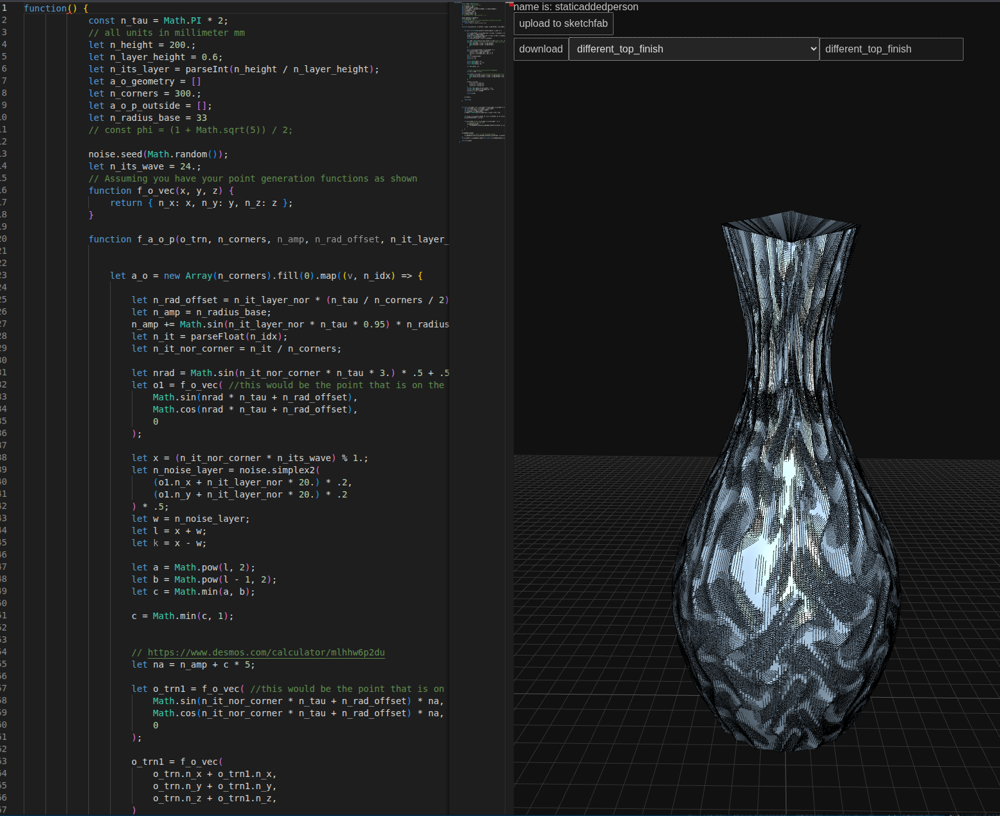

# STL Sculpter

**Turn mathematics into 3D objects.**

A browser-based playground for parametric modeling and generative design. Write JavaScript, shape geometry with mathematical functions, and explore the result in an interactive 3D viewport. A few changes to a formula can turn a regular polygon into a twisted vase, a rippled surface, or an intricate geometric pattern.

Built by **Jonas Immanuel Frey**, this project brings together applied mathematics, custom mesh generation, and interactive graphics in a hands-on creative tool.



*The design and its source code side by side: the surface is generated from equations and sampled points.*

## What you can create

The repository includes built-in designs and a collection of standalone modeling experiments:

| Design space | Possibilities | Explore the source |
| --- | --- | --- |
| Parametric vases | Change profiles, twist cross-sections, bend forms, and vary detail along their height. | [Twisted vase](localhost/vase_exponential_twist.js), [bent vase](localhost/vase_wild_bend.js) |
| Procedural surfaces | Combine periodic functions, power curves, and noise to create ribs, waves, and organic variation. | [Noise-driven vase](localhost/vase_noise_elegant_lines.js), [wave patterns](localhost/vase_elegant_fancy_waves.js) |
| Jewelry and geometric art | Generate stars, rings, repeated cubes, and layered polygon designs. | [Star earrings](localhost/earring_star.js), [layered polygons](localhost/layered_polygon.js) |
| Fractals and tilings | Explore iterative subdivision, rotational symmetry, and repeating geometric structures. | [Koch snowflake](localhost/koch_snowflake.js), [hexagonal triangle tiling](localhost/hexagonal_triangle_tile.js) |
| Curves and extrusions | Turn 2D profiles into 3D forms and sweep shapes along curved paths. | [SVG profile extrusion](localhost/profile_extrusion.js), [custom extrusion helpers](localhost/threejs_custom_extrusions.js) |
| Imported geometry | Experiment with DXF paths, SVG profiles, and existing STL meshes. | [DXF sweep](localhost/parse_dxf_to_threejs_individual_sweep.js), [STL loading](localhost/vase_arosa_sun_load_from_stl.js) |
| Constructive geometry | Combine, subtract, and intersect solids using a CSG library. | [Boolean operations](localhost/boolean_op.js), [perforated embroidery template](localhost/embroidery_template_pva.js) |

Standalone experiments are source examples; some need adaptation or supporting assets and are not all available in the built-in selector.

## From code to geometry

- **Edit and preview:** the integrated Monaco editor regenerates the scene after a short pause in typing, with evaluation errors shown in the editor area.
- **Inspect in 3D:** orbit, pan, and zoom around the model using Three.js controls.
- **Explore variations:** select a built-in design, change its parameters or formulas, and compare the resulting forms.
- **Write your own generators:** return an array of Three.js objects from a JavaScript function; asynchronous functions can load assets before returning geometry.
- **Export a model:** the current download button produces an **OBJ** file for use in other 3D tools.

The interface also includes experimental Sketchfab upload and DeepSeek description-generation integrations, using user-provided API tokens.

## The mathematics behind the shapes

Many vase designs start with a sequence of polygonal rings. Each ring samples an angle around a cross-section; stacking and connecting those rings creates a surface.

One way to express this family of shapes is:

$$
\begin{aligned}
\theta &= 2\pi u + \phi(t) \\
x(u,t) &= c_x(t) + r(u,t)\sin\theta \\
y(u,t) &= c_y(t) + r(u,t)\cos\theta \\
z(u,t) &= Ht
\end{aligned}
$$

Here, $u$ is the normalized position around a ring, $t$ is normalized height, and $H$ is the overall height. The radius function $r$ controls the silhouette and surface detail, $\phi$ controls twist, and $c_x,c_y$ move the centerline to create bending.

This makes design choices concrete mathematical operations:

- **Waves and fluting:** modulate the radius with sine functions; frequency controls repetition and amplitude controls depth.
- **Twist and bending:** vary angular offsets and ring centers with height.
- **Profile shaping:** combine powers, interpolation, and piecewise functions to control how a form widens and narrows.
- **Organic detail:** sample noise across the surface to introduce structured variation.
- **Fractals:** repeatedly subdivide line segments and apply geometric rotations, as in the Koch snowflake example.

The mesh builder converts these points into indexed triangles. For $L$ rings with $N$ vertices each, the side surface uses $LN$ vertices and $2N(L-1)$ triangles. Increasing either sampling count adds detail and increases geometry cost—a direct connection between mathematical resolution and rendering workload.

## Engineering highlights

For a technical walkthrough, these are useful places to start:

| Area | Implementation to inspect |
| --- | --- |
| **Custom mesh construction** | In [client.module.js](localhost/client.module.js), `f_o_geometry_from_a_o_p_polygon_vertex` connects adjacent rings, wraps indices at the seam, builds a `BufferGeometry`, and computes vertex normals. A separate helper creates triangle-fan caps. |
| **Reusable geometric building blocks** | [threejs_custom_extrusions.js](localhost/threejs_custom_extrusions.js) provides helpers for extruded rings, thick line segments, Bézier-based geometry, tangent-circle arrangements, and tilings. |
| **Interactive programming workflow** | [client.module.js](localhost/client.module.js) connects Monaco edits to debounced asynchronous evaluation, scene replacement, and visible error feedback. |
| **Applied algorithmic geometry** | [koch_snowflake.js](localhost/koch_snowflake.js) implements subdivision and rotation; [vase_exponential_twist.js](localhost/vase_exponential_twist.js) combines periodic sampling and power-based shaping. |
| **Asset and library integration** | The client combines Three.js loaders and exporters, DXF parsing, CSG operations, and browser-side API calls. |
| **Local serving** | The [Deno server](websersocket_7fa3d9b0-ee4c-4853-8fa2-626266d7db95.js) serves the application and includes WebSocket connection handling. |

**Stack:** JavaScript ES modules · Three.js / WebGL · Monaco Editor · Deno · DXF parsing · three-csg-ts

Three.js supplies the rendering and geometry infrastructure; Monaco supplies the editor. The project's core is the procedural design code, custom geometry helpers, and the workflow that connects editable functions to rendered objects.

## Run locally

With Deno installed, start the project from this directory:

```sh
deno task start
```

Open the HTTP address printed under `server(s) running` (port **8081**).
Keep the command running while using the app. Press `Ctrl+C` to stop it.

There is no frontend build step. An internet connection is currently needed for remote modules, the editor CDN, and the Sketchfab metadata requests made during startup.

### Try your first variation

1. Select a built-in design from the dropdown.
2. Change a value such as `n_height`, `n_corners`, or `n_radius_base` where present.
3. Wait briefly for the preview to update, then orbit around the result.
4. Change a sine-wave frequency or a height-dependent rotation to explore a new shape.
5. Give the model a name and click **download** to export it as OBJ.

For a minimal custom example, replace the editor contents with this function:

```js
function() {
    const shape = new THREE.Shape();
    const samples = 120;

    for (let i = 0; i < samples; i++) {
        const angle = (i / samples) * Math.PI * 2;
        const radius = 20 + 4 * Math.sin(6 * angle);
        const x = radius * Math.cos(angle);
        const y = radius * Math.sin(angle);
        if (i === 0) shape.moveTo(x, y);
        else shape.lineTo(x, y);
    }
    shape.closePath();

    const geometry = new THREE.ExtrudeGeometry(shape, {
        depth: 8,
        bevelEnabled: false
    });
    return [f_o_shaded_mesh(geometry)];
}
```

Change `6` to vary the number of lobes, `4` to change their depth, or `8` to change the extrusion height.

## Project status

STL Sculpter is an experimental modeling workbench with a broad collection of design studies. Despite its name, the active export path currently uses OBJ; STL loading and sample STL files are also present. Geometry intended for fabrication still needs checking in a slicer or mesh tool for scale, wall thickness, and mesh validity.

Editor code runs directly in the page context. Designs and edits are held in memory, so copy useful code to a file before reloading or switching designs.

## License

[MIT](LICENSE) · Copyright 2025 Jonas Immanuel Frey. Bundled third-party libraries retain their respective licenses.
